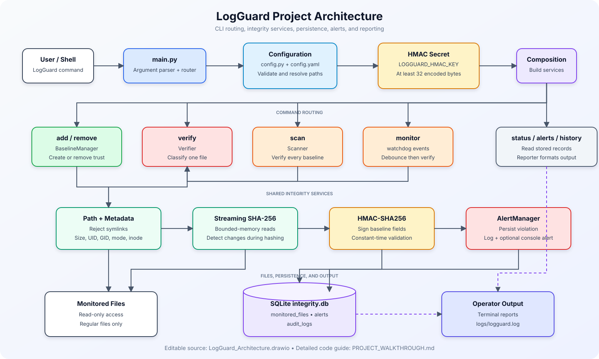

# LogGuard

> A command-line file-integrity monitor that creates authenticated SHA-256
> baselines and detects content, ownership, permission, inode, deletion, and
> baseline-tampering events.


LogGuard is a security-focused Python project for registering regular files,
saving trusted metadata in SQLite, authenticating that baseline with
HMAC-SHA256, and detecting later changes. It supports one-file verification,
batch scans, real-time filesystem events, persistent alerts, and audit history.

LogGuard never edits monitored files, changes their permissions, or requires
administrator/root access. Removing a file from LogGuard only removes its
database registration—it does not delete the physical file.

## Contents

- [Features](#features)
- [Architecture](#architecture)
- [How the code works](#how-the-code-works)
- [Requirements](#requirements)
- [Installation](#installation)
- [Configure the HMAC key](#configure-the-hmac-key)
- [Configuration and customization](#configuration-and-customization)
- [Command reference](#command-reference)
- [Example workflow](#example-workflow)
- [Testing](#testing)
- [Project structure](#project-structure)
- [Security considerations](#security-considerations)
- [Known limitations](#known-limitations)
- [Troubleshooting](#troubleshooting)
- [Publishing to GitHub](#publishing-to-github)

## Features

- Streaming SHA-256 hashing with bounded memory use.
- Detection when a file changes while it is being hashed.
- Canonical path handling and symbolic-link rejection.
- Baselines containing content hash, size, UID, GID, permission bits, inode,
  and modification time.
- HMAC-SHA256 authentication of important baseline fields.
- Constant-time HMAC comparison.
- SQLite storage with parameterized queries and transactional rollback.
- Seven integrity states with clear severity levels.
- Persistent alerts and audit history.
- Batch verification of all registered files.
- Debounced real-time monitoring through `watchdog`.
- Human-readable terminal reports and application logs.
- Isolated pytest coverage using temporary files and databases.

## Architecture

The preview below shows the whole project flow. Click it to open the editable
Draw.io source.

[](LogGuard_Architecture.drawio)

The Draw.io file contains three pages:

1. **ER Diagram** — `monitored_files`, `alerts`, `audit_logs`, and their exact
   database relationship.
2. **Project Flow** — command routing, services, monitored files, persistence,
   and terminal/log output.
3. **Verification Decision Flow** — the precise order used to select an
   integrity status.

Open [`LogGuard_Architecture.drawio`](LogGuard_Architecture.drawio) in
[diagrams.net](https://app.diagrams.net/) or the Draw.io desktop application to
edit it. See [`PROJECT_WALKTHROUGH.md`](PROJECT_WALKTHROUGH.md) for a detailed,
line-referenced explanation of every Python file.

## How the code works

### Main execution flow

1. `main.py` parses `--config` and the selected subcommand.
2. `config.py` safely loads YAML, validates supported values, and resolves
   relative paths from the configuration file's directory.
3. `main.py` configures application logging and initializes the SQLite schema.
4. `HMACManager` reads `LOGGUARD_HMAC_KEY` from the process environment.
5. The CLI composes `Database`, `AlertManager`, `BaselineManager`, `Verifier`,
   and `Reporter`.
6. The selected command invokes baseline, verification, monitoring, database,
   or reporting behavior.

### Component responsibilities

| Component | Responsibility |
|---|---|
| `main.py` | CLI definition, dependency composition, command routing, and exit codes |
| `config.py` | YAML loading, validation, defaults, and path resolution |
| `core/metadata.py` | Path normalization, symlink rejection, and metadata collection |
| `core/hasher.py` | Streaming SHA-256 and concurrent-change detection |
| `core/baseline.py` | Trusted baseline creation and registration removal |
| `core/verifier.py` | Integrity decision logic, status updates, audits, and alert triggering |
| `security/hmac_manager.py` | Deterministic HMAC payloads, signing, and constant-time verification |
| `database/database.py` | SQLite schema, transactions, and parameterized queries |
| `database/models.py` | Immutable typed records for files, alerts, and audits |
| `alerts/alert_manager.py` | Alert persistence, application logging, and optional console output |
| `monitoring/scanner.py` | Batch verification of all registered files |
| `monitoring/watcher.py` | Debounced watchdog events routed through the shared verifier |
| `reports/reporter.py` | Human-readable terminal tables and verification output |
| `tests/` | Isolated tests using pytest temporary paths and SQLite databases |

### Baseline creation

When `add` is used, LogGuard:

1. Resolves and validates the path as a regular, non-symlink file.
2. Captures its metadata.
3. Calculates its SHA-256 digest in chunks.
4. Captures metadata again and rejects the operation if the file changed.
5. Creates an HMAC-SHA256 signature over the trusted baseline fields.
6. Inserts the baseline into `monitored_files`.
7. Adds a successful `BASELINE_CREATED` audit entry.

### Verification precedence

The first matching condition wins:

| Priority | Condition | Status | Severity |
|---:|---|---|---|
| 1 | Baseline HMAC is invalid | `BASELINE_TAMPERED` | `CRITICAL` |
| 2 | Registered path does not exist | `DELETED` | `HIGH` |
| 3 | Path is a symlink or not a regular file | `REPLACED` | `HIGH` |
| 4 | Inode differs from the baseline | `REPLACED` | `HIGH` |
| 5 | Owner UID or group GID differs | `OWNER_CHANGED` | `MEDIUM` |
| 6 | Permission bits differ | `PERMISSION_CHANGED` | `MEDIUM` |
| 7 | SHA-256 differs | `MODIFIED` | `HIGH` |
| 8 | Everything matches | `SAFE` | `INFO` |

Every completed verification updates `status` and `last_checked` and writes an
audit entry. Every non-safe result also creates an alert.

### Database entities

| Table | Purpose | Relationship |
|---|---|---|
| `monitored_files` | One trusted baseline per unique canonical path | Parent of alerts |
| `alerts` | Persistent integrity violations with old/new hashes | `file_id → monitored_files.id` |
| `audit_logs` | Action, target, result, and timestamp history | No foreign key; history survives registration removal |

Deleting a monitored-file registration cascades to its alerts. Audit rows remain
because their `target` is a textual snapshot rather than a foreign key.

## Requirements

- Python **3.10 or newer**.
- `pip` and Python virtual-environment support.
- Read permission for every file you want to monitor.
- A stable HMAC key containing at least 32 encoded bytes.

Python packages are pinned to compatible version ranges in
[`requirements.txt`](requirements.txt):

| Package | Purpose |
|---|---|
| `PyYAML` | Parse `config.yaml` |
| `watchdog` | Real-time filesystem monitoring |
| `pytest` | Run the automated test suite |

Linux is the recommended production platform because UID, GID, Unix permission,
and inode semantics are central to the verifier. macOS exposes similar POSIX
metadata. Windows can run the tool, but ownership, permission, and inode behavior
is filesystem-dependent and does not fully match Unix semantics.

## Installation

Clone the repository first:

```bash
git clone https://github.com/YOUR_USERNAME/Log_Monitoring_Tool.git
cd Log_Monitoring_Tool
```

Replace `YOUR_USERNAME` with the GitHub account or organization that owns the
repository.

### Linux

Ubuntu/Debian users may need the virtual-environment package:

```bash
sudo apt update
sudo apt install -y python3 python3-venv python3-pip
```

Create an isolated environment and install all requirements:

```bash
python3 -m venv .venv
source .venv/bin/activate
python -m pip install --upgrade pip
python -m pip install -r requirements.txt
python -m pip check
```

On Fedora/RHEL, install Python with `sudo dnf install python3 python3-pip`. On
Arch Linux, use `sudo pacman -S python python-pip`.

### macOS

Install Python 3 using [python.org](https://www.python.org/downloads/macos/) or
Homebrew:

```bash
brew install python
```

Then create the environment and install requirements:

```bash
python3 -m venv .venv
source .venv/bin/activate
python -m pip install --upgrade pip
python -m pip install -r requirements.txt
python -m pip check
```

### Windows

Install a current Python release from
[python.org](https://www.python.org/downloads/windows/) and enable **Add Python
to PATH** during setup. In PowerShell:

```powershell
py -3 -m venv .venv
.\.venv\Scripts\Activate.ps1
python -m pip install --upgrade pip
python -m pip install -r requirements.txt
python -m pip check
```

If PowerShell blocks the activation script, allow scripts only for the current
shell and activate again:

```powershell
Set-ExecutionPolicy -Scope Process -ExecutionPolicy Bypass
.\.venv\Scripts\Activate.ps1
```

For Command Prompt instead of PowerShell, activate with:

```bat
.venv\Scripts\activate.bat
```

## Configure the HMAC key

LogGuard deliberately does not store the HMAC secret beside the database. If an
attacker could modify both, they could alter and re-sign a baseline.

Generate a random key after activating the virtual environment.

### Linux and macOS

```bash
export LOGGUARD_HMAC_KEY="$(python -c 'import secrets; print(secrets.token_hex(32))')"
```

### Windows PowerShell

```powershell
$env:LOGGUARD_HMAC_KEY = python -c "import secrets; print(secrets.token_hex(32))"
```

### Windows Command Prompt

Generate a value:

```bat
python -c "import secrets; print(secrets.token_hex(32))"
```

Copy the printed value, then set it for the current Command Prompt session:

```bat
set LOGGUARD_HMAC_KEY=PASTE_THE_GENERATED_VALUE_HERE
```

The examples set the key only for the current shell. Keep the **same secret**
for later runs against the same database. Store it in an operating-system secret
manager, CI/CD secret, or protected environment configuration. Do not commit it,
place it in `config.yaml`, print it in logs, or share it in screenshots.

Changing or losing the key causes existing baselines to report
`BASELINE_TAMPERED`.

> LogGuard reads the process environment directly. It does not automatically
> load `.env` files.

## Configuration and customization

The default [`config.yaml`](config.yaml) is:

```yaml
hash_algorithm: sha256
monitoring:
  scan_interval: 60
  realtime: false
database:
  path: database/integrity.db
logging:
  path: logs/logguard.log
alerts:
  console: true
monitor_paths: []
exclude_patterns:
  - "*.tmp"
```

### Active settings

| Setting | Default | Meaning |
|---|---:|---|
| `hash_algorithm` | `sha256` | Only `sha256` is currently accepted |
| `monitoring.scan_interval` | `60` | Positive number passed to the watcher as its per-path debounce interval |
| `database.path` | `database/integrity.db` | SQLite database path |
| `logging.path` | `logs/logguard.log` | Application log path |
| `alerts.console` | `true` | Print integrity alerts to the terminal |

Relative database and log paths are resolved from the directory containing the
selected configuration file, not necessarily from the current shell directory.

Despite its name, `scan_interval` does not currently start periodic scans. The
`scan` command runs once, while `monitor` uses this value to suppress repeated
events for the same path.

### Reserved settings

`monitoring.realtime`, `monitor_paths`, and `exclude_patterns` are present for a
future directory-policy feature but are not currently used for automatic
registration or command selection. Register files explicitly with `add`.

### Use another configuration file

```bash
python main.py --config /absolute/path/to/logguard.yaml status
```

PowerShell example:

```powershell
python main.py --config "C:\LogGuard\config.production.yaml" status
```

### Common customizations

- Change `database.path` to place integrity data on protected storage.
- Change `logging.path` to integrate with your log collection layout.
- Set `alerts.console: false` for quieter automation while retaining database
  alerts and application logs.
- Reduce `monitoring.scan_interval` when near-real-time repeated checks are more
  important than suppressing burst events.
- Extend `Reporter` for JSON/CSV output.
- Extend `AlertManager` for email, webhook, or SIEM delivery.
- Add a new `IntegrityStatus` and decision branch in `Verifier` when introducing
  another integrity rule; add matching tests at the same time.

## Command reference

Run `python main.py --help` or `python main.py COMMAND --help` for built-in help.

| Command | Purpose |
|---|---|
| `python main.py add PATH` | Create and store a trusted baseline |
| `python main.py remove PATH` | Remove registration without deleting the file |
| `python main.py verify PATH` | Verify one registered file |
| `python main.py scan` | Verify all currently registered files once |
| `python main.py status` | List stored status and last-check time |
| `python main.py alerts` | List integrity alerts, newest first |
| `python main.py history` | List audit history, newest first |
| `python main.py monitor` | Watch registered parent directories until Ctrl+C |

Quote paths containing spaces:

```bash
python main.py add "/path/to/application log.log"
```

```powershell
python main.py add "C:\Logs\application log.txt"
```

### Exit codes

| Code | Meaning |
|---:|---|
| `0` | Command completed successfully; for `verify`, the file is `SAFE` |
| `1` | Configuration, validation, filesystem, missing-registration, or other error |
| `2` | `verify` completed and found a non-safe integrity status |
| `130` | Monitoring was stopped with Ctrl+C |

`scan` currently returns `0` after printing its summary even when one or more
files have a non-safe result. Use individual `verify` calls when automation must
use exit code `2` as a policy signal.

## Example workflow

Use disposable files for demonstrations rather than important system logs.

### Linux and macOS

```bash
printf '%s\n' 'Original log entry' > demo.log
python main.py add demo.log
python main.py verify demo.log

printf '%s\n' 'Unexpected log entry' >> demo.log
python main.py verify demo.log
python main.py alerts
python main.py history
```

The first verification reports `SAFE`. After appending data, verification
reports `MODIFIED` and creates a `HIGH`-severity alert.

### Windows PowerShell

```powershell
Set-Content -Path demo.log -Value "Original log entry"
python main.py add demo.log
python main.py verify demo.log

Add-Content -Path demo.log -Value "Unexpected log entry"
python main.py verify demo.log
python main.py alerts
python main.py history
```

### Batch and real-time checks

```bash
python main.py scan
python main.py monitor
```

The watcher observes the parent directories of files registered when it starts,
debounces burst events, waits briefly for writes to settle, and invokes the same
`Verifier` used by manual and batch checks. Restart it after adding or removing
registrations so its in-memory path set is refreshed.

## Testing

Activate the virtual environment, set no production paths, and run:

```bash
python -m pytest -q
```

The tests use pytest temporary directories and databases. They do not access
`/var/log` or your configured production database.

Current tests cover:

- empty, large, and spaced-name file hashing;
- baseline creation, duplicates, missing files, and symlink rejection;
- safe, modified, deleted, permission, inode-replacement, and tampered-HMAC
  verification;
- SQLite insertion, status updates, audit records, and safe removal;
- configuration defaults and malformed sections;
- multi-file batch scanning.

For a discussion of currently uncovered edges, see
[`PROJECT_WALKTHROUGH.md`](PROJECT_WALKTHROUGH.md#8-test-coverage-and-uncovered-edges).

## Project structure

```text
Log_Monitoring_Tool/
├── main.py                       CLI and application composition
├── config.py                     Configuration loader and validator
├── config.yaml                   Default settings
├── alerts/
│   └── alert_manager.py          Persistent/logged/console alerts
├── core/
│   ├── baseline.py               Baseline lifecycle
│   ├── hasher.py                 Streaming SHA-256
│   ├── metadata.py               Path and file metadata safety
│   └── verifier.py               Integrity classification
├── database/
│   ├── database.py               SQLite schema and operations
│   └── models.py                 Immutable row models
├── monitoring/
│   ├── scanner.py                Batch scanning
│   └── watcher.py                Real-time watchdog monitoring
├── reports/
│   └── reporter.py               Terminal formatting
├── security/
│   └── hmac_manager.py           Baseline HMAC authentication
├── tests/                        Pytest suite
├── docs/
│   └── logguard-architecture.svg GitHub architecture preview
├── LogGuard_Architecture.drawio  Editable ER and flow diagrams
├── PROJECT_WALKTHROUGH.md        Full line-referenced code guide
├── requirements.txt              Python dependencies
└── README.md                     Repository landing page
```

Runtime-created databases, logs, virtual environments, caches, secrets, Draw.io
backup files, and IDE configuration are excluded through `.gitignore`.

## Security considerations

- Protect the HMAC key separately from the SQLite database.
- Run LogGuard as a dedicated unprivileged account with read access only to
  intended files and write access only to its database/log locations.
- Protect `database/integrity.db` and `logs/logguard.log` with operating-system
  permissions.
- SHA-256 reads are chunked, and device/inode/size/nanosecond-mtime values are
  checked across each read to detect concurrent changes.
- Symbolic links are rejected during registration. A symlink or non-regular
  replacement is classified as suspicious during verification.
- SQL values are parameterized and connection failures trigger rollback.
- Baseline HMAC comparisons use `hmac.compare_digest`.
- Secrets are not logged by the application.
- HMAC detects edits to authenticated baseline fields but cannot prevent
  deletion of the entire database or deletion/reordering of alert/audit rows.
  Higher-assurance deployments need protected external storage or signed audit
  chaining.

## Known limitations

- This is static snapshot verification. Normal growth of an active log is still
  reported as `MODIFIED`; the result means *different*, not automatically
  *malicious*.
- Append-only/prefix verification is not implemented.
- Log rotation is not interpreted. Rotation may appear as deletion or inode
  replacement.
- Monitoring is file-by-file; recursive directory policy is not implemented.
- `monitor_paths` and `exclude_patterns` are reserved but inactive.
- The watcher snapshots registrations at startup.
- Alerts are not deduplicated across separate checks.
- There is no built-in email, webhook, SIEM, or JSON output.
- UID, GID, inode, and Unix permission semantics are Linux-oriented. Windows
  metadata checks offer reduced assurance.
- A batch scan stops if a per-file verification raises an uncaught error.

## Troubleshooting

### `LOGGUARD_HMAC_KEY is required`

Set the key in the same terminal session that runs LogGuard. See
[Configure the HMAC key](#configure-the-hmac-key).

### `LOGGUARD_HMAC_KEY must contain at least 32 bytes`

Generate a new value with the documented Python `secrets.token_hex(32)` command.
Do not shorten the output.

### `file is not monitored`

Register the exact file first:

```bash
python main.py add "/path/to/file.log"
```

Then confirm its normalized path with `python main.py status`.

### `watchdog is not installed`

Activate the intended virtual environment and reinstall requirements:

```bash
python -m pip install -r requirements.txt
python -m pip check
```

### `BASELINE_TAMPERED`

Confirm that the process is using the same HMAC key that created the baseline.
If the key is correct, protect and investigate the database before creating a
new baseline; authenticated baseline data may have been changed.

### Permission denied

The account running LogGuard needs read access to the monitored file and write
access to the configured database and application-log directories. Avoid
running as root merely to bypass an incorrectly scoped permission policy.

### Symbolic links are not supported

Register the real regular-file path, not a symbolic-link alias.

## Publishing to GitHub

Before publishing, review the files and ensure no secret, generated database, or
runtime log is staged. Then initialize and push the repository:

```bash
git init
git add .
git status
git commit -m "Initial LogGuard release"
git branch -M main
git remote add origin https://github.com/YOUR_USERNAME/Log_Monitoring_Tool.git
git push -u origin main
```

Create the empty GitHub repository before adding the remote, and replace
`YOUR_USERNAME` with its owner. If this directory is already a valid Git
repository, skip `git init` and inspect the existing remote with `git remote -v`
before changing it.

### Pre-publication checklist

- [ ] Replace `YOUR_USERNAME` in clone/push examples if desired.
- [ ] Confirm `.env`, databases, logs, `.venv`, caches, IDE settings, and Draw.io
      backups are not staged.
- [ ] Confirm `LOGGUARD_HMAC_KEY` does not appear in tracked files or history.
- [ ] Run `python -m pip check` and `python -m pytest -q`.
- [ ] Open the README on GitHub and confirm the SVG preview is visible.
- [ ] Choose and add a `LICENSE` file before advertising reuse terms.
- [ ] Add repository topics such as `python`, `security`, `file-integrity`,
      `sha256`, `hmac`, `sqlite`, and `watchdog`.

## Contributing

Keep changes focused, preserve parameterized SQL and key separation, and add or
update tests for every behavior change. Run the complete test suite before
opening a pull request. Security-sensitive changes should describe their threat
model, assumptions, and failure behavior.

## License

No license has been selected yet. Add an appropriate `LICENSE` file before
publishing if you want others to use, modify, or redistribute the project.
